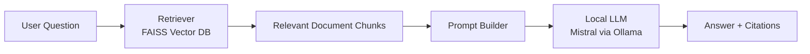
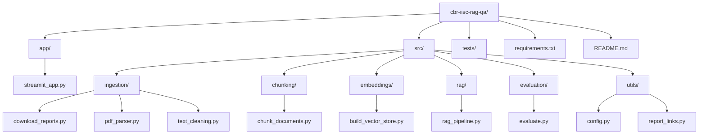

# 🧠 CBR IISc Annual Report QA — Local RAG System


A fully local **Retrieval Augmented Generation (RAG)** question-answering system that answers questions about the last 3 years of annual reports from the **Centre for Brain Research (CBR), IISc**.

This project was built as an end-to-end Machine Learning + LLM engineering project for technical interviews.

---

## ✨ Features

- 🏠 100% **local** — no paid APIs
- 🔓 Uses **open-source LLM (Mistral via Ollama)**
- 📄 Answers questions from real PDF reports
- 📌 Provides **citations with year + page**
- ✅ Includes **evaluation pipeline**
- 💬 Comes with a **Streamlit chat UI**

---

## 🎥 Demo

Ask questions like:
- *What is the GenomeIndia project?*
- *What studies does CBR conduct on aging?*
- *Who funds the GenomeIndia project?*

The system retrieves relevant report sections and generates grounded answers with citations.

---

## 🏗️ System Architecture


### Pipeline Overview

1. **Data Ingestion**
   - Automatically downloads latest CBR annual reports (PDFs)
   - Extracts text page-by-page

2. **Pre-processing**
   - Cleans and normalizes text
   - Splits into semantic chunks

3. **Embedding + Vector Store**
   - SentenceTransformer embeddings
   - FAISS local vector database

4. **RAG Pipeline**
   - Retrieve relevant chunks
   - Build grounded prompt
   - Generate answer with citations

5. **Evaluation**
   - Retrieval quality testing
   - Answer faithfulness testing

6. **User Interface**
   - Streamlit chat app

---

## 📂 Project Structure


---

## 🛠️ Tech Stack

| Component | Tool |
|-----------|------|
| Language | Python |
| LLM | Mistral (Ollama) |
| Framework | LangChain |
| Embeddings | SentenceTransformers |
| Vector DB | FAISS (local) |
| UI | Streamlit |
| PDF Parsing | pdfplumber |

---

## ⚙️ Setup Instructions

### 1️⃣ Clone the repository
```bash
git clone https://github.com/<your-username>/cbr-iisc-rag-qa.git
cd cbr-iisc-rag-qa
```

### 2️⃣ Create virtual environment
```bash
python -m venv venv
source venv/bin/activate  # On Windows: venv\Scripts\activate
```

### 3️⃣ Install dependencies
```bash
pip install -r requirements.txt
```

### 4️⃣ Install Ollama

Download from: https://ollama.com
```bash
ollama pull mistral
ollama serve
```

---

## 📥 Build the Knowledge Base
```bash
python -m src.ingestion.download_reports
python -m src.ingestion.pdf_parser
python -m src.ingestion.text_cleaning
python -m src.chunking.chunk_documents
python -m src.embeddings.build_vector_store
```

---

## 💬 Run the Assistant (Terminal)
```bash
python -m src.rag.rag_pipeline
```

---

## 🖥️ Run the Web App
```bash
streamlit run app/streamlit_app.py
```

Open in browser: http://localhost:8501

---

## 📊 Evaluation

Run the evaluation suite:
```bash
python -m src.evaluation.evaluate
```

This tests:
- ✅ Retrieval relevance
- ✅ Generation faithfulness
- ✅ Citation grounding

---

## 🎯 Design Decisions

### Why RAG?
- Annual reports are long, domain-specific documents
- RAG grounds LLM responses in real documents and prevents hallucinations

### Why Local LLM?
- ✅ No paid APIs
- ✅ Fully offline
- ✅ Reproducible
- ✅ Demonstrates real engineering skills

### Why FAISS?
- ⚡ Fast local similarity search
- 🏠 No external infrastructure required

### Why PDF Page Citations?
- Annual reports have inconsistent printed page numbers
- Using deterministic PDF page numbers ensures reliable and verifiable citations

---

## 🧪 Evaluation Strategy

We evaluate two aspects:

### Retrieval Quality
Check whether top-k retrieved pages are relevant for benchmark questions.

### Answer Faithfulness
Verify that generated answers:
- ✅ Use retrieved context
- ✅ Provide citations
- ✅ Avoid hallucinations

---

## 🚀 Future Improvements

- [ ] Hybrid search (BM25 + embeddings)
- [ ] Reranking models
- [ ] Conversation memory
- [ ] Cloud deployment
